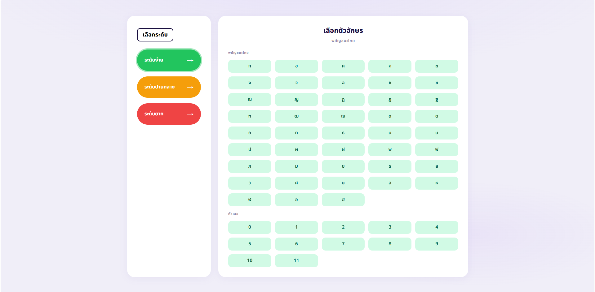
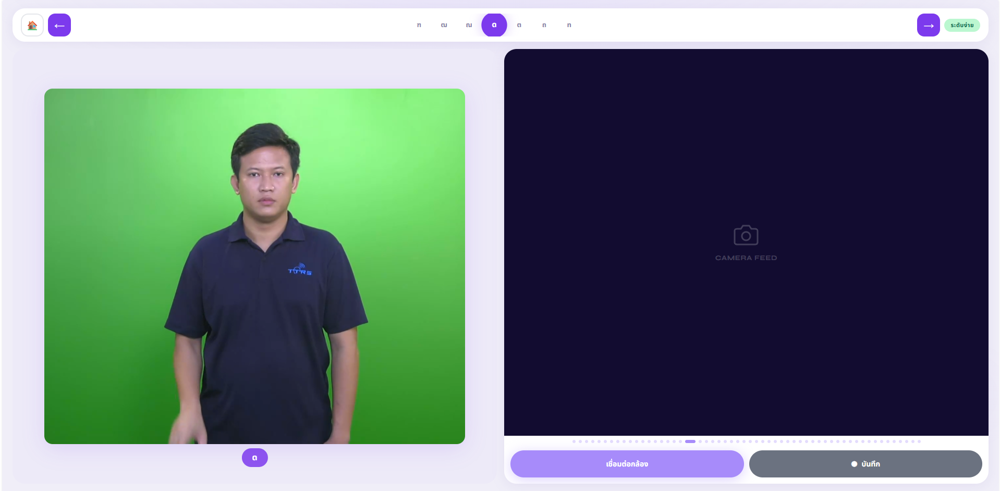
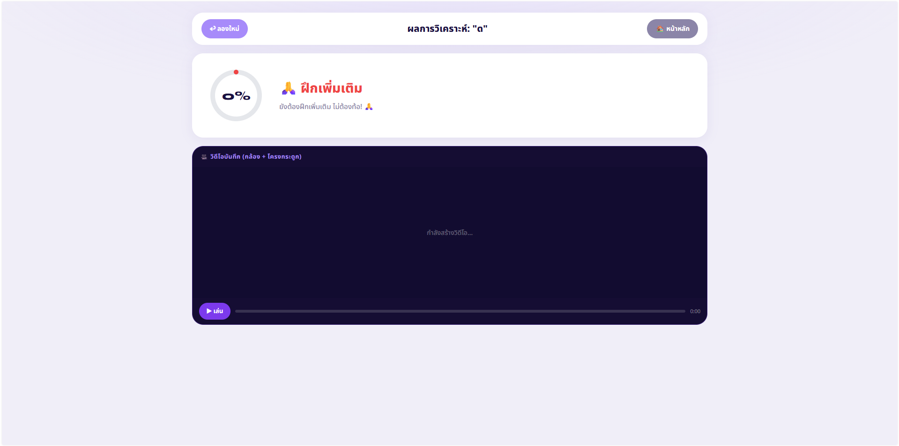

# 🤟 Sign Language Checker

ระบบเว็บแอปสำหรับฝึกและตรวจสอบภาษามือภาษาไทย โดยใช้ MediaPipe วิเคราะห์ท่าทางแบบ real-time และเปรียบเทียบกับท่าอ้างอิงด้วย DTW (Dynamic Time Warping)

---

## 🖥️ ภาพรวมของหน้าต่างการใช้งาน (Screenshots)

### 1. หน้าแรก (Home Screen) — เลือกระดับและตัวอักษร


### 2. หน้าฝึกซ้อม (Processing Screen) — แนะนำท่าทางและบันทึกวิดีโอจากกล้อง


### 3. หน้าผลลัพธ์ (Feedback Screen) — ตรวจสอบคะแนนและวิดีโอวิเคราะห์ข้อผิดพลาด


---
 
## ✨ ฟีเจอร์หลัก

- เลือกระดับ **ง่าย / ปานกลาง / ยาก** (พยัญชนะ, ตัวเลข, คำ, ประโยค)
- บันทึกท่าทางจากกล้องเว็บแคมแบบ real-time
- ตรวจจับ Pose + Hands พร้อมกันผ่าน MediaPipe
- วิเคราะห์ความถูกต้องและให้คะแนน 0–100
- แสดงวิดีโอ feedback พร้อม skeleton สี (🟢 ถูก / 🔴 ผิด)
- แสดง joint ที่ทำผิดบ่อยเป็น error chips

---

## 📁 โครงสร้างโปรเจกต์

```
project/
├── main.py                  # FastAPI server + API endpoints
├── utils.py                 # Core logic: MediaPipe, DTW, normalize, export
│
├── static/
│   ├── state.js             # Global state & constants (โหลดก่อนสุด)
│   ├── mediapipe.js         # Tracking pipeline + canvas drawing
│   ├── app.js               # UI logic, recording, API calls
│   └── style.css            # Styles ทั้งหมด
│
├── templates/
│   └── index.html           # Single-page app (3 screens)
│
├── static/mediapipe/        # MediaPipe JS libraries
│   ├── camera_utils/
│   ├── drawing_utils/
│   ├── pose/
│   └── hands/
│
├── models/
│   ├── hand_landmarker.task # MediaPipe Hand model
│   └── pose_landmarker.task # MediaPipe Pose model
│
├── npy/
│   ├── easy/                # Reference skeletons ระดับง่าย
│   ├── medium/              # Reference skeletons ระดับปานกลาง
│   └── hard/                # Reference skeletons ระดับยาก
│
└── Videos/                  # วิดีโอตัวอย่างท่าทาง (optional)
```

---

## ⚙️ การติดตั้ง

### 1. Clone และสร้าง virtual environment

```bash
git clone <repo-url>
cd <project-folder>
python -m venv venv
source venv/bin/activate        # Windows: venv\Scripts\activate
```

### 2. ติดตั้ง Python dependencies

```bash
pip install fastapi uvicorn opencv-python mediapipe fastdtw numpy
```

> **หมายเหตุ:** ต้องมี `ffmpeg` ติดตั้งในระบบเพื่อ encode วิดีโอ feedback เป็น H.264 mp4
> หากไม่มี ระบบจะ fallback เป็น `.avi` อัตโนมัติ

### 3. ดาวน์โหลด MediaPipe Models

วางไฟล์ใน `models/`:

- [`hand_landmarker.task`](https://developers.google.com/mediapipe/solutions/vision/hand_landmarker)
- [`pose_landmarker.task`](https://developers.google.com/mediapipe/solutions/vision/pose_landmarker)

---

## 🚀 การรัน

### รัน Web App

```bash
# python main.py
uvicorn main:app --reload 
```

จากนั้นเปิด browser ที่ `http://localhost:8000`

> **สำคัญ:** Browser ต้องการ **HTTPS หรือ localhost** เท่านั้นจึงจะขอ camera permission ได้

### รัน CLI (ทดสอบแบบ standalone)

```bash
python utils.py --ref npy/easy/th_dorDek.npy --camera 0
```

| ปุ่ม | การทำงาน |
|------|----------|
| `SPACE` | เริ่ม / หยุดบันทึก |
| `Q` | ออกจากโปรแกรม |

ผลลัพธ์: `output_raw.mp4` และ `output_feedback.mp4`

---

## 🔌 API Endpoints

| Method | Path | คำอธิบาย |
|--------|------|----------|
| `GET` | `/` | หน้าแรกของแอป |
| `GET` | `/api/slides/{level}` | ดึงรายการคำ/อักษรตามระดับ (`easy`, `medium`, `hard`) |
| `GET` | `/api/video/{item}` | URL วิดีโอตัวอย่างของคำนั้น |
| `GET` | `/api/npy/{item}` | ตรวจสอบว่ามีไฟล์ reference `.npy` หรือไม่ |
| `POST` | `/api/analyze` | วิเคราะห์ท่าทาง ส่งคืนคะแนน + errors |
| `GET` | `/api/feedback/{id}` | ดู feedback video (stream) |
| `GET` | `/api/feedback/{id}/download` | ดาวน์โหลด feedback video |

### ตัวอย่าง Request: `/api/analyze`

```json
{
  "item": "ก",
  "fps": 20.0,
  "frames": [
    { "joints": [[0.5, 0.3], [0.48, 0.31], ...] }
  ]
}
```

### ตัวอย่าง Response

```json
{
  "score": 82.5,
  "global_errors": [13, 14, 15],
  "message": "ยอดเยี่ยม! ภาษามือของคุณถูกต้องมาก 🎉",
  "feedback_id": "XXXXX_1234567890"
}
```

---

## ➕ การเพิ่มคำหรือตัวอักษรใหม่

### ขั้นตอนที่ 1 — บันทึก reference skeleton

```bash
python utils.py --ref /dev/null --camera 0
# กด SPACE เพื่อบันทึกท่า reference แล้วกด SPACE อีกครั้งเพื่อหยุด
```

จากนั้น export ไฟล์ `.npy` และนำไปวางใน `npy/<level>/`

### ขั้นตอนที่ 2 — เพิ่มใน `main.py`

**เพิ่มใน `SLIDES`** (เพื่อให้แสดงใน UI):

```python
"easy": {
    "consonants": ["ก", "ข", ..., "ฉ"],   # เพิ่มตัวใหม่ที่นี่
    ...
}
```

**เพิ่มใน `NPY_MAP`** (เพื่อให้ระบบหา reference ได้):

```python
NPY_MAP = {
    ...
    "ฉ": "npy/easy/th_chorChing2.npy",    # เพิ่ม mapping ที่นี่
}
```

**เพิ่มใน `VIDEO_MAP`** (optional — ถ้ามีวิดีโอตัวอย่าง):

```python
VIDEO_MAP = {
    ...
    "ฉ": "th_chorChing.mp4",
}
```

---

## 🧠 หลักการทำงาน

```
กล้อง (640×480)
    │
    ▼
MediaPipe Pose + Hands (JS)
    │  extractXYImage() → array (75, 2)
    │  pose[0..32] + leftHand[33..53] + rightHand[54..74]
    │
    ▼
บันทึก N frames
    │
    ▼
POST /api/analyze
    │
    ▼  normalize_skeleton()
    │  root = midpoint(L-Shoulder, R-Shoulder)
    │  scale = dist(shoulder_center, hip_center)
    │
    ▼  run_dtw_and_errors()
    │  fastdtw เปรียบเทียบกับ reference .npy
    │  SPATIAL_THRESH = 0.08
    │  TEMPORAL_THRESH = 8 frames
    │
    ▼
score (0–100) + global_errors + per_frame_errors
    │
    ▼
Render feedback video (skeleton สีแดง/เขียว)
    │
    ▼
แสดงผลใน screen-result
```

---

## ⚠️ ข้อควรระวัง

- **ลำดับ `<script>` ใน `index.html` ห้ามสลับ:** `state.js` → `mediapipe.js` → `app.js`
- **Camera ต้องการ HTTPS หรือ localhost** — ไม่ทำงานบน HTTP ธรรมดา
- **ไฟล์ `.npy` ต้องมี shape `(T, 75, 2)`** และผ่าน `normalize_skeleton()` มาแล้ว
- **Hand label (Left/Right)** ใน MediaPipe JS อาจ mirror กับ Python — ตรวจสอบให้ตรงกันเมื่อบันทึก reference
- MediaPipe Hands ถูก process **ทุก 2 frames** (`frameCount % 2 === 0`) เพื่อประสิทธิภาพ
- Feedback video เก็บใน memory (`_feedback_store`) — จะหายเมื่อ server restart

---

## 📦 Dependencies สรุป

| Package | ใช้ทำอะไร |
|---------|-----------|
| `fastapi` + `uvicorn` | Web server |
| `mediapipe` | Pose & Hand landmark detection (Python) |
| `opencv-python` | วาด skeleton, export video |
| `fastdtw` | Dynamic Time Warping |
| `numpy` | จัดการ array ของ landmarks |
| `ffmpeg` (system) | Re-encode video เป็น H.264 mp4 |

---

